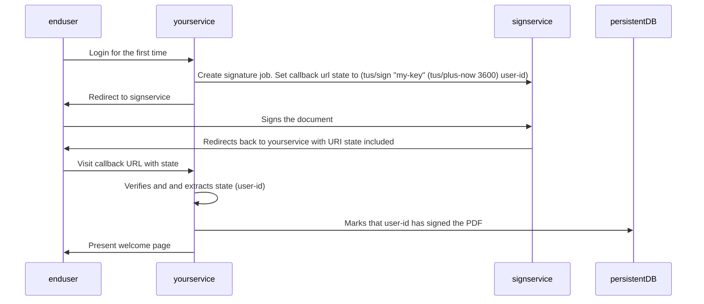

# tamperproof-uri-state

Tamperproof uri state. With expiration.

Ever wanted to store some tamperproof state in a URL? Look no further.

Zero external dependencies (besides the JVM).

## Rationale

Your service sends an end user to an external service for a short task.
The external service supports custom callback URLs / URL parameters.

Your service does not want to
store unnecessary state, so it includes the state it needs to resume
work after the task is completed in the callback URL.

As the state is kept by the external service, a restart to your service will
not delete the state.

When your service is visited with the callback URL, it can verify that the callback
state is signed by your service and then use the state to resume doing whatever it
needs to do.

For example in a signing process:



## Installation

```
com.github.ivarref/tamperproof-uri-state {:git/sha "7118e6e540f52744ff615dcc7c25aa57b23fb933"}
```

## Usage

```clojure
(require '[com.github.ivarref.tamperproof-uri-state :as tus])

(tus/sign "my-key" (tus/plus-now 3600) "my-state")
; Valid for one hour (3600 seconds): (+ 3600 (/ (System/currentTimeMillis) 1000))
=> "bXktc3RhdGU=.Z_KAig==.s6VGTnzNyzStOoJpGxtuDVvNwqh6HDfrWId3adn6Q98="

(tus/unsign "my-key" (tus/now) "bXktc3RhdGU=.Z_KAig==.s6VGTnzNyzStOoJpGxtuDVvNwqh6HDfrWId3adn6Q98=")
=> "my-state"
; returns `nil` if expired
; returns `nil` if incorrect signature
```

Arguments for `sign` function:

* The first argument should be the actual private key (_not_ a file). It must be either a `string` or a `byte array`. If your key is in a file, you will have to slurp it yourself.
* The second argument is the expiry time in epoch seconds. Use `(tus/plus-now some-number)` to set an expiry `some-number` of seconds in the future.
* The third argument is the state to save. It must be a string.

`sign` will return a URI encoded string that contains the state, the expiry time and a signature.
This can be used in for example in a callback URL where you do not want to store temporary state in your service.
The tamperproof state URI will survive a service restart as long as the private key is the same.
As the return value is URI encoded, you do not need to further encode if including it in e.g. a callback URL.

Arguments for `unsign` function:

* The first argument should be a private key. It must be either a `string` or a `byte array`. If your key is in a file, you will have to slurp it yourself.
* The second argument is the current time in epoch seconds. Use `(tus/now)` to use the current time. This parameter can also be left out. It will then default to the current time. 
* The third argument is the URI encoded string that was returned by `sign`. It must be a string.

`unsign` will return the state string if and only if the signature was correct and it was not expired. Otherwise, it will return `nil`.

## "Advanced" usage

```clojure
(require '[com.github.ivarref.tamperproof-uri-state :as tus])

(def state-with-hash (tus/sign "my-key" (tus/plus-now 3600) "my-state"))

(let [{:keys [tampered? expired? state]} (tus/unsign-to-map "my-key" (tus/now) state-with-hash)]
  (cond tampered?
        (log/error "Call the cops ...") ; state will be nil
        
        expired?
        (log/warn "Slow user alert ...") ; state will be nil
        
        state
        (do
          (log/info "Do some work"))))
```

### Details

`sign` and `unsign` uses `HmacSHA256` for generating a signature/hash.
This, combined with the custom encoding, yields a smaller amount of bytes than using a regular JWT would.
An external system/user can view the contents of the state, but cannot verify its authenticity.
There is not public key here. This means that the recipient of the signed/hashed state should be the same service
or another service with an identical private key.


### IFAQ.

> Did you just "roll your own crypto"?

No, I rolled my own "Java standard library interop in Clojure".

> Why?

It was the least worst (aka best) I could think of.

> IFAQ?

That is InFrequently Asked Questions.

## Further reading

[HMAC in Java](https://www.baeldung.com/java-hmac).

## License

Copyright © 2025 Ivar Refsdal

Distributed under the Eclipse Public License either version 2.0 or (at
your option) any later version.