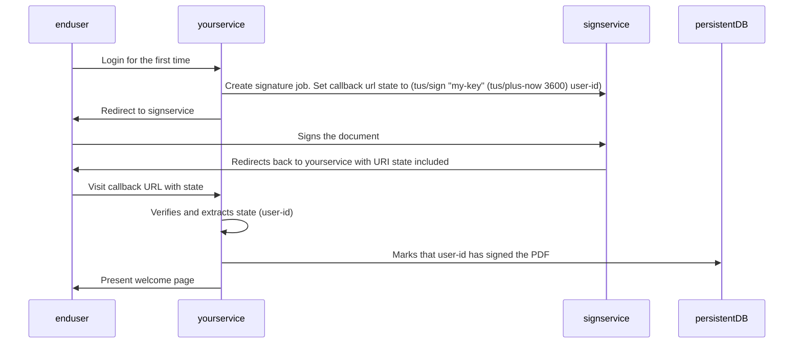

# encrypted-url-state

Encrypted url state. With expiration.

Ever wanted to store some encrypted state in a URL? Look no further.

## Rationale

Your service sends an end user to an external service for a task.
The external service supports custom callback URLs / URL parameters.

Your service does not want to
store unnecessary state, so it includes the state it needs to resume
work after the task is completed in the callback URL.

As the state is kept by the external service, a restart to your service will
not delete the state.

When your service is visited with the callback URL, it can verify that the callback
state originated from your service and then use the state to resume doing whatever it
needs to do.

For example in a signing process:



## Installation

```
com.github.ivarref/encrypted-url-state {:git/sha "..."}
```

## Usage

```clojure
(require '[com.github.ivarref.encrypted-url-state :as eus])

; Encrypt:
(eus/encrypt "my-key" "my-state") ; Default expiry: 3600 seconds (1 hour) from now
=> "TlBZDrDCzqg7goKQvpijViGM2_jEZEJqFk1Gcqibt5W64UzQLfYvbLnATi8TqUYuwg=="

; Explicit expiry given as epoch time in seconds: 24 hours from now
(eus/encrypt "my-key" (eus/curr-epoch-time-plus-seconds (* 24 3600)) "my-state")
=> "TlBZDtz_UPYPEal6qmk-ACMUogigcP01wMZc_UWdg60fN6YHdmkrhfM9m7FH3wVlEw=="


; Decrypt:
(eus/decrypt "my-key" *1) ; Default epoch time: (long (/ (System/currentTimeMillis) 1000))
=> {:expired? false, :state "my-state", :error? false, :error-message nil}

; Explicit epoch time:
(eus/decrypt "my-key" 1746604368 "TlBZDtz_UPYPEal6qmk-ACMUogigcP01wMZc_UWdg60fN6YHdmkrhfM9m7FH3wVlEw==") 
=> {:expired? false, :state "my-state", :error? false, :error-message nil}

; :error? will be true if a tamper attempt was detected:
(eus/decrypt "my-key" (eus/encrypt "attacker-key" "my-state"))
=> {:expired? false, :state nil, :error? true, :error-message "Thaw failed. Possible decryption/decompression error, unfrozen/damaged data, etc."}

; :expired? will be true if the message was expired:
(eus/decrypt "my-key" (eus/encrypt "my-key" (eus/curr-epoch-time-plus-seconds -10) "my-state"))
=> {:expired? true, :state nil, :error? false, :error-message "Expired"}


; Full typical usage:
(let [input (eus/encrypt "my-key" "my-state")
      {:keys [error? expired? state]} (eus/decrypt "my-key" input)]
  (cond error?
        :call-the-cops ; state will be nil

        expired?
        :slow-user-alert ; state will be nil

        :else
        :do-work!))
```

### Details

`sign` and `unsign` use `HmacSHA256` for generating a signature/hash.
This, combined with the custom encoding, yields a smaller amount of bytes than using a regular JWT would.
An external system/user can view the contents of the state, but cannot verify its authenticity.
There is not public key here. This means that the recipient of the signed/hashed state should be the same service
or another service with an identical private key.


### IFAQ.

> Did you just "roll your own crypto"?

No, I rolled my own "Java standard library interop in Clojure".

> Why?

It was the least worst (aka best) I could think of.

> IFAQ?

That is InFrequently Asked Questions.

## Further reading

[HMAC in Java](https://www.baeldung.com/java-hmac).

## License

Copyright © 2025 Ivar Refsdal

Distributed under the Eclipse Public License either version 2.0 or (at
your option) any later version.